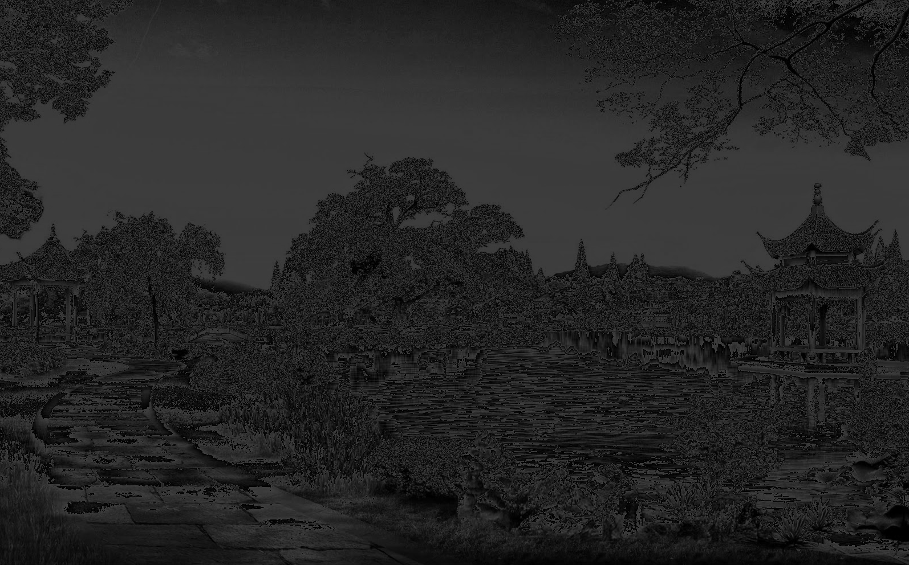
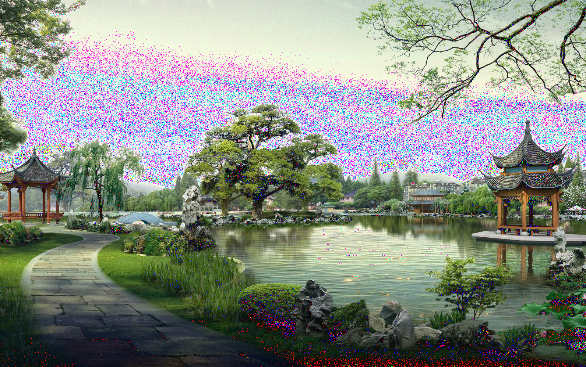

Examples
=====================================

Some examples are already available into documentation. You can find here some others and results of use of IPFML package.

All examples below will use this picture.

.. image:: _static/nature.jpg

Metrics example
--------------------

Using **metrics** module you can convert image into Lab, XYZ, SVD...

.. code:: python
   
   from PIL import Image
   from ipfml import metrics

   img_path = 'path/to/image_nature.jpg'
   img = Image.open(img_path)
   
   s = metrics.get_LAB_L(img)

   # convert result into PIL Image
   output = Image.fromarray(s)
   output.show()

This is the generated output using only L chanel from Lab.

.. image:: _static/nature_lab_l.png

Processing example
--------------------

.. code:: python
   
   from PIL import Image
   from ipfml import processing

   img_path = 'path/to/image_nature.jpg'
   img = Image.open(img_path)
   
   low_bits_img = processing.rgb_to_grey_low_bits(img, 6)
   
   output = Image.fromarray(low_bits_img)
   output.show()

Now we have picture information with only the 6 low bits values.

Noise filter example
---------------------

.. code:: python
   
   from PIL import Image
   from ipfml.filters import noise as nf

   img_path = 'path/to/image_nature.jpg'
   img = Image.open(img_path)

   # set noise impact to 400
   # set same noise for each chanel
   noisy_image = nf.gaussian_noise(img, n=400, identical=True)

   output = Image.fromarray(noisy_image)
   output.show()
   
Image result after applying gaussian noise on nature image.

